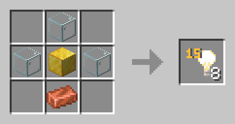
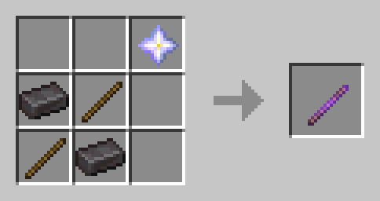
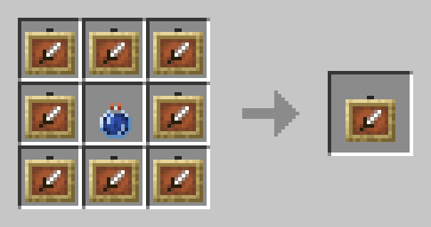
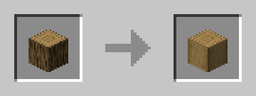

# Крафты

## Невидимый свет

## Палка отладки

## Невидимые рамки

> В центральном слоте используется оседающее зелье невидимости I ур.

## Обрамленное дерево

> Для крафта используется камнерезка. Возможно с любым видом дерева.

